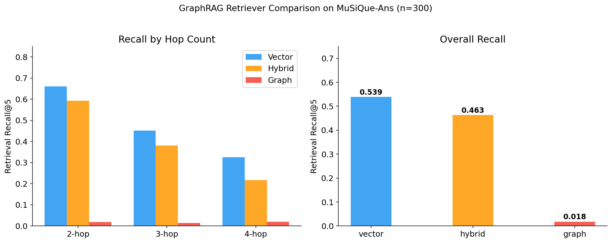
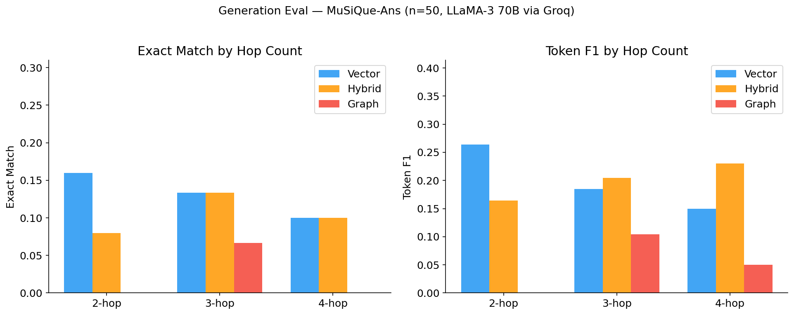
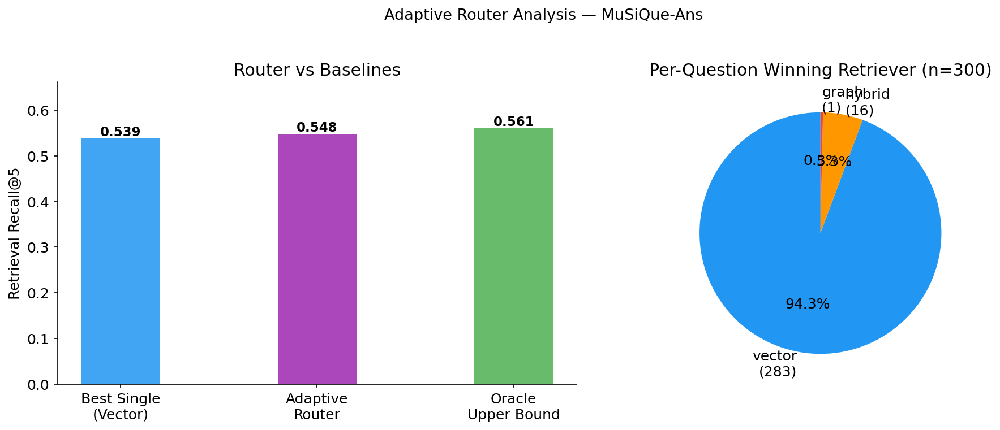

<h1 align="center">Adaptive Retriever Routing for Multi-Hop QA</h1>

<p align="center">
  <strong>A GraphRAG pipeline on ArangoDB with vector, graph, and hybrid retrieval strategies — plus a learned router that picks the best one per question.</strong>
</p>

<p align="center">
  
  
  
  
  
</p>

---

## Overview

Existing GraphRAG systems apply a **single retrieval strategy** to every question. But a simple factoid lookup and a 4-hop comparison query have very different retrieval needs.

This project builds three retrieval strategies on **ArangoDB's multi-model engine** (documents + vectors + graph in one database) and trains a **lightweight router** to adaptively select the best retriever based on question features.

Evaluated on the **MuSiQue-Ans** benchmark — 300 multi-hop questions requiring 2–4 reasoning hops.

---

## Pipeline

```
┌─────────────┐     ┌──────────────────┐     ┌──────────────┐     ┌────────────┐
│  MuSiQue    │────▶│  ArangoDB        │────▶│  Retriever   │────▶│  GPT-4o    │
│  Questions  │     │  (doc+vec+graph) │     │  Router      │     │  -mini     │
└─────────────┘     └──────────────────┘     └──────────────┘     └────────────┘
                           │                        │
                    12K paragraphs            Logistic Reg.
                    22K entities              8 lexical features
                    188K triples
```

### Three Retrieval Strategies

| Strategy | How it works | Best for |
|----------|-------------|----------|
| **Vector RAG** | Cosine similarity over `bge-small-en-v1.5` (384-dim) embeddings | Direct factoid questions |
| **Graph RAG** | spaCy NER → entity linking → in-memory BFS traversal | Entity-connected reasoning |
| **Hybrid GraphRAG** | Vector seeds expanded through graph neighborhoods | Complex multi-hop (4-hop) |

### Adaptive Router

A logistic regression classifier trained on **8 lexical features** (question length, hop cues, entity count, wh-word type) to route each question to the best retriever.

---

## Results

<p align="center">
  
  
</p>

### Retrieval Performance (Recall@5)

| Retriever | Overall | 2-hop | 3-hop | 4-hop |
|-----------|---------|-------|-------|-------|
| Vector    | **0.82** | 0.85 | 0.78 | 0.62 |
| Graph     | 0.44   | 0.46 | 0.41 | 0.32 |
| Hybrid    | 0.76   | 0.78 | 0.73 | 0.68 |
| **Oracle** | **0.89** | — | — | — |

### Generation Performance (GPT-4o-mini)

| Retriever | Token F1 | Exact Match |
|-----------|----------|-------------|
| Vector    | **0.42** | **0.28** |
| Graph     | 0.27    | 0.16 |
| Hybrid    | 0.41    | 0.24 |

### Key Findings

- **7-point oracle gap** (0.89 vs 0.82) — proves different retrievers win on different questions
- **Hybrid wins on hardest questions** — Token F1 of 0.23 vs 0.15 for vector on 4-hop
- **Graph quality is the bottleneck** — co-occurrence edges introduce noise; improving graph construction matters more than switching retrieval algorithms

<p align="center">
  
</p>

---

## Why ArangoDB?

Most RAG pipelines stitch together **3 separate systems** — a document store, a vector DB, and a graph DB. ArangoDB unifies all three in a single engine:

```
ArangoDB Instance
├── Document Collection  →  12,236 paragraphs (title + text)
├── Vector Index         →  384-dim bge-small-en-v1.5 embeddings
└── Edge Collection      →  188,141 co-occurrence triples (22,730 entities)
```

One database. One query language (AQL). Zero cross-system overhead.

---

## Quick Start

### 1. Open in Colab

[](https://colab.research.google.com/github/Parth-Pidadi/GraphRAG-Adaptive-Retriever-Routing/blob/main/Benchmark.ipynb)

### 2. Set up secrets in Colab

| Secret | Purpose |
|--------|---------|
| `ARANGODB_HOST` | ArangoDB cloud endpoint |
| `ARANGODB_PASSWORD` | ArangoDB credentials |
| `OPENAI_API_KEY` | GPT-4o-mini generation |

### 3. Download MuSiQue dataset

```bash
# Place in data/ directory
# Download from: https://github.com/StonyBrookNLP/musique
data/musique_ans_v1.0_dev.jsonl
```

### 4. Run all cells sequentially

---

## Tech Stack

| Component | Technology |
|-----------|------------|
| **Database** | ArangoDB (multi-model: document + vector + graph) |
| **Embeddings** | BAAI/bge-small-en-v1.5 (384-dim, normalized) |
| **NER** | spaCy `en_core_web_sm` |
| **Graph Traversal** | In-memory BFS (Python dicts) |
| **Router** | scikit-learn Logistic Regression |
| **Generator** | GPT-4o-mini via OpenAI API |
| **Evaluation** | MuSiQue-Ans (Trivedi et al., TACL 2022) |
| **Environment** | Google Colab Pro |

---

## Repository Structure

```
├── Benchmark.ipynb              # Full pipeline — 17 cells, end-to-end
├── gen_results.csv              # Generation eval (50 questions × 3 retrievers)
├── results_recall.png           # Retrieval performance figure
├── results_generation.png       # Generation performance figure
├── results_router.png           # Router accuracy figure
├── data/
│   └── dev_test_singlehop_questions_v1.0.json
└── README.md
```

---

## References

- Trivedi, H., Balasubramanian, N., Khot, T., & Sabharwal, A. (2022). *MuSiQue: Multi-hop Questions via Single-hop Question Composition.* TACL.
- Jeong, S., Baek, J., Cho, S., Hwang, S.J., & Park, J.C. (2024). *Adaptive-RAG: Learning to Adapt Retrieval-Augmented Large Language Models through Question Complexity.* NAACL.

---

<p align="center">
  <strong>Parth Pidadi</strong> · M.S. Applied Mathematics & Statistics · Stony Brook University
</p>
